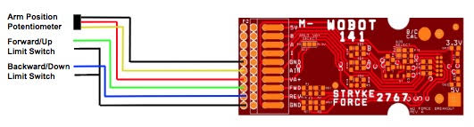

# Robot Arm Details
The robot arm is a 2 part arm with an articulated **bucket** which collects/dispatches hatches and cargo. In an
ideal world, we would map the desired capture/deliver positions for the arm into buttons on the joystick.

## Immediate Tasks
The first prototype of the arm has been constructed. These are the immediate tasks:
* (done) potentiometer indexing - the arms have a travel range significantly less than
  360&deg;. Make sure the shaft coupling is indexed so the entire range of motion
  falls withing a rotation and does not cross the 0:max boundary.
* (done) find the limits - Once the potentiometers are indexed, move the arms to the
  physical limits of motion and record those limits.
* (done) run the motor and set (or map) directions so positive motion raises the arms.
* wire limit switches to the talon controllers and verify they work as expected.
* get basic control working with potentiometers hooked to the Roborio working as expected.
* wire the potentiometers to directly to the TALON SRC instead of the Roborio.
* get the classes for subsystem and command using the Talon SRX working as expected.

## Requirements
* The robot arm needs to be positioned to pickup hatches at a center height of 1'7" and deliver hatches:
  * at 1'7" for the cargo ship;
  * at 1'7", 3'11", and 6'3" for the rocket.
* The robot arm need to be positioned to pickup balls (cargo) either from the floor or from the dispatch
at a height of 3'7-1/2" and deliver cargo at:
  * at 2'3-1/2" for the cargo ship;
  * at 2'3-1/2",4'7-1/2", and 6'11-1/2" for the rocket.
* The robot arm needs to park at some stable 'home' position for driving.
* The robot arm needs to work in conjunction with the pneumatic lifts to lift and park the robot on the top
  platform at endgame (height 1'7").

## Physical Implementation

These are the details:
* The arm is a 2-part arm supporting a collector/ejector head.
* Each arm is powered by a [CIM motor](https://www.andymark.com/products/2-5-in-cim-motor),
  free speed 5310rpm. Each motor has a 64:1 gearbox to a chain drive with a 4:1 gear ratio -
  for a combined ratio of 256:1, or free speed at the arm pivot of 20rpm or 120&deg;/sec.
* Each motor is controlled by a Cross the Road Electronics (CTR) Talon SRX motor
  controller. This controller includes limit switch and encoder/potentiometer inputs
  to on-board PID and limit switch capability.
* The position of each arm is sensed using a
  [SENSOR ROTARY 360DEG SLDR TURRET](https://www.digikey.com/product-detail/en/tt-electronics-bi/6127V1A360L.5FS/987-1393-ND/2620662).
  These we initially hooked to the Roborio, we have since secure breakout boards to hook these directly
  to the Talon SRX so we can use the close loop control in the TALON (sample time 1ms and compared to 20-30ms
  in the Roborio)
* [The Sentinal - Talon SRX breakout board - Users Guide](http://wmralliance.com/wp-content/uploads/2016/12/TheSentinel-Talon-SRXBreakoutBoardUsersGuide.pdf) -
  The breakout board for wiring the arm potentiometer and limit switches directly to the Talon SRX. It is
  wired like this:
  

## Robot Arm Subsystem

Two versions:
* **ArmDriveChain.java** - sensors attached to the Roborio
* **ArmDriveSrx** - sensors attached to the Talon SRX